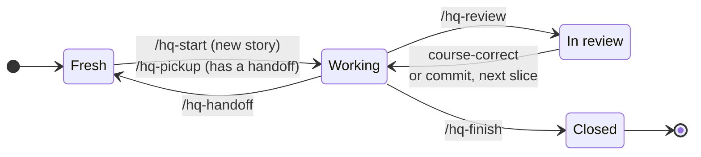

# Headquarters

> **Kate's fork** of [nothingalike/headquarters](https://github.com/nothingalike/headquarters) — all credit to
> nothingalike for the system. Adaptation plan: **[DESIGN.md](DESIGN.md)**. This README is adapted for the fork:
> all skills carry an `hq-` prefix, story tracking runs on Beads, and an `hq-dashboard` skill is added.

Shared memory and workflow skills for agentic programming. Agents keep project knowledge, story-level working memory, and handoffs in `~/.headquarters`, outside every code repo, so any agent (Claude Code, Codex, ...) can pick up where another left off.

## Install

This fork is cloned locally and its skills are symlinked into `~/.claude/skills`, so editing the repo
updates the live skills:

```bash
git clone https://github.com/kate-hansen/headquarters.git ~/Desktop/github/headquarters
for skill in ~/Desktop/github/headquarters/skills/*/; do
  ln -s "$skill" ~/.claude/skills/"$(basename "$skill")"
done
```

Each skill reads the shared guide at `../hq/GUIDE.md`. Then run `/hq-setup` once on your machine, and
`/hq-init` inside each project you work on.

## Skills

| Skill | Invoked by | What it does |
|---|---|---|
| `hq` | you or the agent | Recall, remember, update, or forget memory. Holds [the guide](skills/hq/GUIDE.md) every other skill follows. |
| `hq-setup` | you, once per machine | Creates `~/.headquarters`, writes your working preferences (`me.md`), and points your agents at it. |
| `hq-init` | you, once per project | Interactive questionnaire that sets up or refreshes a project's `project.md`. |
| `hq-handoff` | you | Writes a dated handoff for the current story so a fresh session can continue. |
| `hq-pickup` | you | Reads a story's handoff trail and briefs you before resuming. |
| `hq-review` | you or the agent | When a slice is done, opens an HTML report in your browser: sections about behaviour in review order, risk chips, every claim linked into VS Code, short snippets, the tests that prove each section, and a suggested commit message. |
| `hq-dashboard` | you or the agent | Opens one HTML page across all your projects: headquarters projects, PRs awaiting your review, and today's Beads. |
| `hq-artifact-design` | the agent | House method for HTML pages people read: tokens, type, light/dark, layout, copy, and local-page mechanics. Our own version of the artifact-design method, used by `hq-review`, `hq-dashboard`, and any report an agent writes. |

## Workflow

Working on a user story moves through four states. Each transition is a skill, or an action you take yourself.



| State | What's happening |
|---|---|
| **Fresh** | A new session with no context loaded. |
| **Working** | The agent is oriented on the story and building. |
| **In review** | The agent has reported what it did and why, and waits for you. |
| **Closed** | The agent's work on the story is done; lessons are promoted and the final record is written. |

| Transition | Skill | What it does |
|---|---|---|
| Fresh → Working | `/hq-start` *(planned)* | Begins a new story: sets up its headquarters folder and analyzes the story. |
| Fresh → Working | `/hq-pickup` | Resumes from the story's handoff trail and briefs you first. |
| Working → Fresh | `/hq-handoff` | Captures the session so a fresh one can continue with a clear head. |
| Working → In review | `/hq-review` | Reports what was done and why, linking files and lines. |
| In review → Working | you | Course-correct, or commit and move on to the next slice. |
| Working → Closed | `/hq-finish` *(planned)* | Promotes lessons, writes the story's final record, and produces an outcome report for the team: evidence of what changed, alongside the code review. |

Nothing stores the current state: it's worked out from what's in the story's headquarters folder and from the conversation. These states are separate from your tracker's story statuses, which change only when you ask.

The `mattpocock-skills` plugin supplies **companion skills** that pair with each state — `research` / `domain-modeling` / `codebase-design` / `grilling` when orienting, `tdd` / `prototype` / `diagnosing-bugs` when building, `code-review` alongside `/hq-review`, plus `resolving-merge-conflicts`, `wizard`, and `writing-for-agents` as utilities. The guide's [Companion skills](skills/hq/GUIDE.md) section maps each one; the transition skills point at the fitting one in context.

## Daily close-out

Separate from the per-story flow, a daily rhythm logs time. A LaunchAgent in [`reminders/harvest-timesheet/`](reminders/harvest-timesheet/) nudges once each weekday afternoon (3:45pm ET) to run `/harvest-timesheet`. The timesheet skills are [nothingalike/harvest-skills](https://github.com/nothingalike/harvest-skills); only the reminder lives here, and every Harvest entry is yours to confirm.
